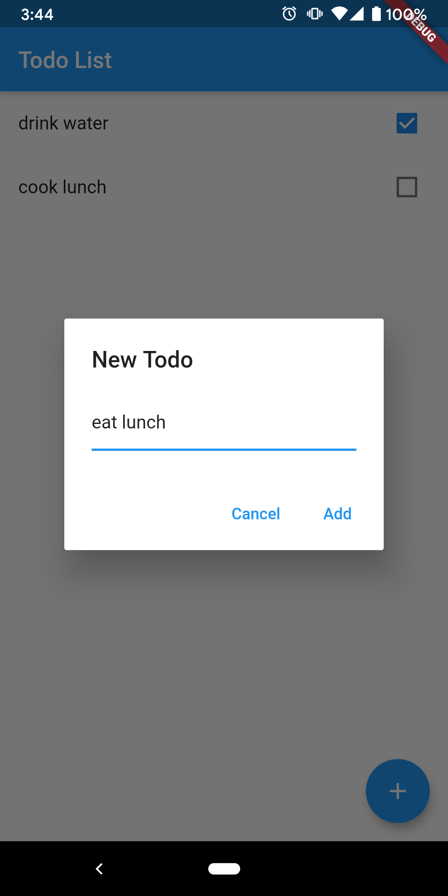

# todo_list

A simple Todo List mobile application written with Flutter.





I am looking into adding persistent storage, web services, and Google accounts connection.

## Getting Started

To start running:

```bash
flutter pub get
flutter run
```

## Credit

Followed [Flutter TodoList Tutorial](https://github.com/lesnitsky/todolist_flutter) to create.
